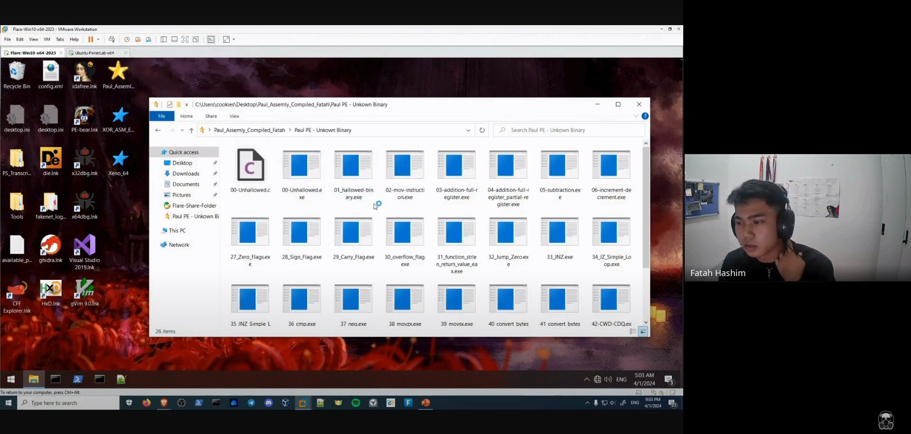

This is the workshop series "Reverse Engineering and Binary Exploitation: Intel x86/x86-x64 Assembly" by Fatah Hashim.

`Date: 12/29/23 2:21 AM`

<!-- tag="Trojan" image="./pictures/test.jpg" -->


  
  
  


The slide is available at: https://speakerdeck.com/x86fatah/x86-x64-assembly

This workshop content draws upon valuable resources from a variety of contributors. Their expertise and insights are gratefully acknowledged