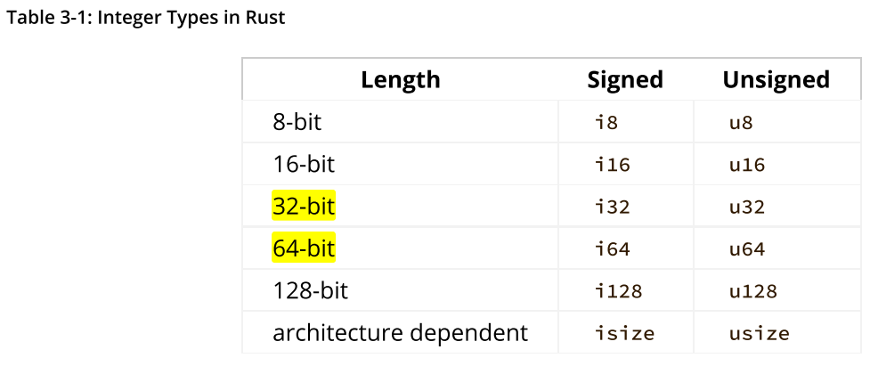
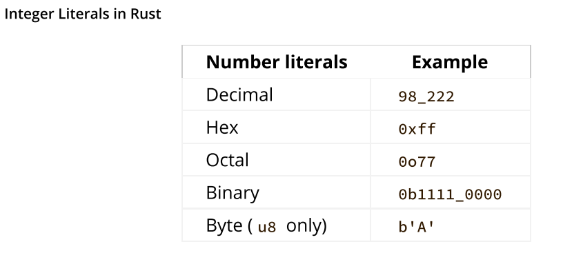

- `rustup update` -> updating to a newly released version
- `rustup self uninstall` -> To uninstall Rust and rustup
- `rustup doc` -> local copy of the documentation so that you can read it offline
- `rustfmt` -> utomatic formatter tool to format your code in a particular style. exp: `rustfmt .\main.rs`
- `cargo build` -> build binary to debug .exe
- `Cargo.lock` ->  This file keeps track of the exact versions of dependencies in your project.
- `cargo run` -> compile the code and then run the resultant executable
- `cargo check` -> quickly checks your code to make sure it compiles but doesn’t produce an executable
- `build --release` -> to compile it with optimizations
- `cargo update` -> figure out all the latest versions, Cargo will only look for versions greater. example: Updating rand v0.8.5 -> v0.8.6 (available: v0.9.0)

- If you’re using more than one word in your filename, the convention is to use an underscore to separate them. For example, use hello_world.rs rather than helloworld.rs.
- Git files won’t be generated if you run cargo new within an existing Git repository; you can override this behavior by using `cargo new --vcs=git`
- If you started a project that doesn’t use Cargo, as we did with the “Hello, world!” project, you can convert it to a project that does use Cargo. Move the project code into the src directory and create an appropriate Cargo.toml file. One easy way to get that Cargo.toml file is to run `cargo init`, which will create it for you automatically.
- - `cargo check` is much faster than `cargo build` because it skips the step of producing an executable
- - By default, Rust has a set of items defined in the standard library that it brings into the scope of every program. This set is called the prelude, and you can see everything in it in the standard library documentation.(https://doc.rust-lang.org/std/prelude/index.html)
- `()` -> parentheses with no parameters.
- `println!` is a macro.
- variable are immutable by default.
- `use std::io;` -> standard library
- The `&` indicates that this argument is a reference.  references are immutable by default.
- Result ’s variants are `Ok` and `Err`
- If this instance of Result is an Err value, expect will cause the program to crash and display the message that you passed as an argument to expect .

```rust
let x = 5;
let y = 10;

println!("x = {x} and y + 2 = {}", y + 2);

// This code would print x = 5 and y + 2 = 12.
```

`[dependencies], `[package]` is call section.

`rand::thread_rng().gen_range(1,101);` 
->  we call the `rand::thread_rng` function
-> Then we call the `gen_range` method 

`use rand::Rng;`
-> `Rng` is trait.

Another neat feature of Cargo is that running the `cargo doc --open` command will build documentation provided by all your dependencies locally and open it in your browser.

```rs
Ordering::Less => println!("Too small!"),
Ordering::Greater => println!("Too big!"),
Ordering::Equal => println!("You win!"),
```

The Ordering type is another enum and has the variants Less, Greater, and Equal.
 
`match` construct are powerful Rust features

rather than crashing the program when the user inputs a nonnumber, let’s make the game ignore a non-number so the user can continue guessing. `continue`

`Result` is an enum that has the variants `Ok` and `Err`.

variables are immutable, once a value is bound to a name, you can’t change that value.

`const` -> constants are values that are bound to a name and are not allowed to change. Constants aren’t just immutable by default— they’re always immutable. exp: `const THREE_HOURS_IN_SECONDS: u32 = 60 * 60 * 3;`

Rust’s naming convention for `constants` is to use all uppercase with underscores between words.

```rs
fn main() {
  let mut x: u32 = 1;
  x = "Hello world";
  println!("{x}");
}

# error, this is not shadowing. error is the mut. to change the type from number to strings.
```

```rs
fn main() {
  let mut x: u32 = 1;
  {
    let mut x = x;
    x += 2;
  }
  println!("{x}");
}

output: 1
```

Rust is a **statically** typed language, which means that it must know the types of all variables at compile time



Additionally, the isize and usize types depend on the architecture of the computer your program is running on: 64 bits if you’re on a 64-bit architecture and 32 bits if you’re on a 32-bit architecture.

Number literals can also use _ as a visual separator to make the number easier to read, such as `1_000` ,which will have the same value as if you had specified `1000` .



## Creating a new application or library

Applications use `src/main.rs` as their entrypoint, and libraries use `src/lib.rs` as their entrypoint.

```bash
cargo init . #cargo current folder. You need to create the folder and change directory(cd) inside it to apply.
cargo help
cargo new new-project
cargo run
cargo new project2 --lib # sub project
cd project2
tree # list all files with nice view
cargo test 
```

## Building, running, and testing

```bash
cargo clean
time cargo build #time??
cargo clean
time cargo check #time??
```

## Switching between toolchains

```bash
# rustup toolchain install nightly
# Runs tests with stable channel
cargo +stable test

# Runs tests with nightly channel
cargo +nightly test

# Only applies to the current directory and its children, allows you to keep the stable channel by default, but switch to nightly for specific projects.
rustup override set nightly

# update the Cargo.lock file with the newest available crates
available crates

# Adds the rand crate as a dependency to the current project
cargo add <crate>

# Add sub project library
cargo new num_cpus --lib
```

## Patching dependencies

```bash
cargo new patch-num-cpus
cd patch-num-cpus
cargo run
```


`num_cpus` dependency to `Cargo.toml`

```toml
[dependencies] 
num_cpus = "1.16.0" # Change this based on version
```

```rust
# src/main.rs

fn main() { 
    println!("There are {} CPU", num_cpus::get());
}
```

`cargo run`

`cargo new num_cpus --lib`

we’ll patch the default `src/lib.rs` to implement `num_cpus::get()`

```rust
# Return some arbitrary value, for test purposes
pub fn get() -> usize { 
    100
}
```

Go back up a directory to the original patchnum-cpus project, and modify `Cargo.toml` to use the replacement crate

```toml
[dependencies] 
num_cpus = { path = "num_cpus" }
```

OR 

Patch a dependency using a fork from GitHub

```toml
[dependencies] 
num_cpus = { git = "https://github.com/brndnmtthws/num_cpus", rev = "b423db0a698b035914ae1fd6b7ce5d2a4e727b46" }
```

`cargo run`

## Publishing Crates

Once your crate is ready to go, you can run `cargo publish`, and Cargo takes care of the details.

## Binary distribution - Cross compilation


Cross-compile binaries for different targets. You can easily compile Linux binaries on Windows, but compiling Windows binaries on Linux is not as easy (but not impossible).

```bash
# List the available targets on your host platform
rustup target list
# install different targets
rustup target add <target>
# build for a particular target
cargo build --target <target>
```

copy the binary to that target machine and run it there successfully.

## Building statically linked binaries

Recommend statically linking to musl when you want to distribute Linux binaries for maximum portability.

```bash
RUSTFLAGS="-C target-feature=+crt-static" cargo build
# Make sure musl target is installed
rustup target add x86_64-unknown-linux-musl
# Compile using musl target and force static C runtime.
RUSTFLAGS="-C target-feature=+crt-static" cargo build--target x86_64-unknown-linux-musl 
# explicitly disable static linking 
[target.x86_64-pc-windows-msvc]
RUSTFLAGS="-C target-feature=-crt-static"
# ~/.cargo/config (31)
[target.x86_64-pc-windows-msvc]
rustflags = ["-Ctarget-feature=+crt-static"]
```

## Documenting Rust projects

Start by creating a library

`cargo new rustdoc-example --lib`

`src/lib.rs` to add a function called `mult`. We’ll also add a test.

```rust
pub fn mult(a: i32, b: i32) -> i32 { 
    a * b
}

#[cfg(test)] 
mod tests { 
    use super::*; 
    #[test] 
    fn it_works() { 
        assert_eq!(2 * 2, mult(2, 2));
    } 
}
```

```bash
# let’s generate some empty documentation
cargo doc
tree .
```

lib.rs filepath: `file:///home/<user>/Documents/<directory name>/rustdoc-example/target/doc/src/rustdoc_example/lib.rs.html`

Main Menu Docs: `/home/<user>/Documents/<directory name>/rustdoc-example/target/doc/rustdoc_example/index.html`

Let’s add a compiler attribute and some docs to our project. 

```rust
# src/lib.rs
//! # rustdoc-example 
//! 
//! A simple project demonstrating the use of rustdoc with the function 
//! [`mult`].

// This compiler attribute tells rustc to generate a warning when docs are missing for public functions, modules, or types.
#![warn(missing_docs)]


// Below (///) This comment provides the documentation for the function mult.
/// Returns the product of `a` and `b`. 
pub fn mult(a: i32, b: i32) -> i32 { 
    a * b
}

```

Rust documentation is formatted using CommonMark, a subset of Markdown. A reference for CommonMark can be found at https://commonmark.org/help.

In documented crates, you should update Cargo.toml to include the documentation property, which links to the documentation for the project. This is helpful for those who find their crate on sources like crates.io.

```toml
[package] 
name = "dryoc" 
documentation = "https://docs.rs/dryoc"
```

## Modules

Rust, all symbols are declared as private by default, but they can be exported (or made publicly visible) with the `pub` keyword. 

A module declaration block uses the mod keyword, with an optional pub visibility specifier, and is followed immediately by a code block in braces:

```rust
mod private_mod { 
    // Private code goes here
    // ...
}
pub mod public_mod { 
    // Public code to be exported goes here.
    // ...
}
```

Modules can be deeply nested:

```rust
mod outer_mod { 
    mod inner_mod { 
        mod super_inner_mod { 
            ...
        } 
    }
}
```

When we include a symbol or module from another crate, we do so with the use statement like so:

```bash
# Includes the Serialize and Serializer symbols from the ser module within the serde crate
use serde::ser::{Serialize, Serializer};
```

## Cargo Workspace

Create new top level application

`cargo new <directory name>`

Subproject simple library

```
cd <directory name>
cargo new <subproject name> --lib
```

List all directory & subdirectory: `tree`

Update top-level Cargo.toml to include subproject by adding it as a dependency. (note: dont add at inside subproject `.toml`)

```toml
# There is 3 thing need to be change here. 
[dependencies]

<subproject name> = {path = "./<subproject name>"}

[workspace]
members = ["<subproject name>"]
```

Check. Make sure everything compiles without any error.

`cargo check`

Filepath: `<subproject name>/src/librs`

```rust
pub fn hello_world() -> String {
    String::from("Hello, World!")
}
```

Update `src/main.rs`(top-level application) to call the function

```rust
fn main() {
    println!("{}", <subproject name>::hello_world());
}
```

Run the code: `cargo run`

- Complete reference cargo workspace: https://doc.rust-lang.org/cargo/reference/workspaces.html

## Custom building scripts

```bahs
cargo new build-script-example
cd build-script-example
```

Make a tiny C library with a function that returns the string "Hello, world!". Create a file called `src/hello_world.c`

```c
// hello_world.c
const char *hello_world(void) {
    return "Hello, world!";
}
```

update Cargo.toml to include the `cc` crate as a build dependency and the `libc` crate for C types

```toml
[dependencies]
libc = "0.2"

[build-dependencies]
cc = "1.0"
```

build script(build.rs) at the top-level directory (not inside `src/`, where the other source files are).

```rust
fn main() {
    println!("cargo:rerun-if-changed=src/hello_world.c"); // Instructs Cargo to only rerun the build script when src/hello_world.c is modified
    cc::Build::new() // Compiles the C code into a library using the cc crate
        .file("src/hello_world.c")
        .compile("hello_world");
}
```

update `src/main.rs` to call the C function from our tiny library

```rust
use libc::c_char;
use std::ffi::CStr;

extern "C" {
    fn hello_world() -> *const c_char; // Defines the external interface of the C library
}

fn call_hello_world() -> &'static str { // A wrapper around the external library that extracts the static C string

    unsafe {
        CStr::from_ptr(hello_world())
            .to_str()
            .expect("String conversion failure")
    }
}

fn main () {
    println!("{}", call_hello_world());
}
```

compile and run the code

```
cargo run
```

## Memory Allocation

- https://crates.io/crates/heapless -> Memory Allocation. Data structures with fixed sizes and no dynamic allocation.

If dynamic memory allocation is desired, it’s relatively easy to create your own allocator by implementing the GlobalAlloc trait 

- https://doc.rust-lang.org/core/alloc/trait.GlobalAlloc.html

TIP: On Linux systems, you should statically link to musl rather than using the system’s C library for maximum portability when distributing precompiled binaries.
